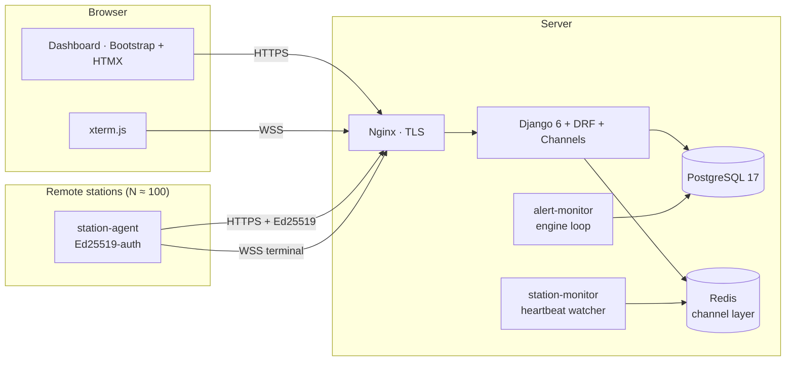

# OE5XRX Station Manager

[](https://github.com/OE5XRX/station-manager/actions/workflows/ci.yml)
[](https://github.com/OE5XRX/station-manager/actions/workflows/deploy.yml)
[](LICENSE)
[](https://www.djangoproject.com/)

Fleet-management server for the [OE5XRX Amateurfunkclub für Remote
Stationen](https://www.oe5xrx.at) (Austria). Manages up to ~100 remote
amateur-radio stations (Raspberry Pi CM4 carrier + STM32 mainboard),
paired with the [linux-image][li] Yocto build.

Live at [ham.oe5xrx.org](https://ham.oe5xrx.org).

[li]: https://github.com/OE5XRX/linux-image

---

## What it does

- **Station inventory** — callsign, GPS, photos, logbook, tags
- **Live status** — WebSocket heartbeats (online/offline, CPU, temp, RAM, disk)
- **OTA rollouts** — staged deployments with A/B, health-check, bootcount rollback
- **Firmware management** — upload, sign, track which station runs which
- **Remote terminal** — xterm.js in the browser, WebSocket-bridged to a
  shell on the station
- **Monitoring & alerts** — email + Telegram when something misbehaves
- **Audit log** — every meaningful action, per-station and global
- **Role-based UI** — admin / operator / member

---

## Architecture



Every station holds an **Ed25519 device keypair** (current/next slots
for safe rotation). Heartbeats, OTA status, and terminal sessions are
all authenticated with signatures — no shared secrets, no token leak
risk.

---

## Tech stack

| Layer | Choice |
|---|---|
| Web framework | Django 6.0 + DRF 3.17 |
| Realtime | Django Channels (ASGI) + Redis channel layer |
| DB | PostgreSQL 17 |
| Frontend | Bootstrap 5.3, HTMX, xterm.js |
| i18n | Django i18n (en / de) |
| Crypto | `cryptography` (Ed25519) |
| Alerts | Django email + `python-telegram-bot` |
| Prod reverse-proxy | Nginx + Let's Encrypt (certbot) |
| Container | Multi-arch (amd64 + arm64) GHCR image |
| CI | GitHub Actions |
| Deploy | Self-hosted runner → `docker compose pull && up -d` |

---

## Local development

Prerequisites: Docker + Docker Compose, and `make` optional.

```bash
git clone git@github.com:OE5XRX/station-manager.git
cd station-manager
cp .env.example .env
# generate a dev secret key
python3 -c "import secrets; print(secrets.token_urlsafe(50))" \
  | xargs -I{} sed -i "s|<generate-with:.*>|{}|" .env

docker compose up -d db redis
docker compose up web   # http://localhost:8000
```

Create a superuser:

```bash
docker compose exec web python manage.py createsuperuser
```

Run tests + lint:

```bash
docker compose exec web pytest
docker compose exec web ruff check .
docker compose exec web ruff format --check .
```

---

## Apps

| App | Responsibility |
|---|---|
| `accounts` | Custom user model, roles (admin/operator/member), i18n prefs |
| `api` | REST API (DRF), Ed25519 auth, device-key rotation |
| `stations` | Station CRUD, photos, logbook, tags, heartbeat persistence |
| `firmware` | Upload, sign, version firmware; per-station assignment |
| `deployments` | OTA rollouts: staged, health-checked, rollback-aware |
| `builder` | Trigger + track `linux-image` builds from the UI |
| `tunnel` | WebSocket bridge: browser ↔ station shell (xterm.js) |
| `monitoring` | Alert rules/engine/notifications (email + Telegram) |
| `audit` | Global audit log across all apps, CSV/JSON export |
| `dashboard` | Role-aware landing page |

---

## Production deploy

Pushing to `main` triggers [`deploy.yml`](.github/workflows/deploy.yml):

1. Multi-arch image built (`amd64` + `arm64`) and pushed to GHCR
2. Self-hosted runner on the prod host pulls the image
3. `docker compose up -d --force-recreate` across web/db/redis/nginx
   plus the two workers (`station-monitor`, `alert-monitor`)
4. `manage.py migrate --noinput`
5. Health check against `https://ham.oe5xrx.org/api/v1/health/`

The prod compose file lives under `deploy/`. Secrets (DB password,
Django key, Telegram token, SMTP credentials) are passed through
`.env` on the server — never committed.

### Required GitHub Secrets

| Secret | Purpose |
|---|---|
| `GITHUB_TOKEN` | GHCR push (auto-provided) |

That's it — everything else is on the deploy host.

---

## Alerting

Rules live in the DB (`monitoring.AlertRule`) and are editable in the
admin UI. Thresholds ship sensible defaults (CPU > 80 °C, disk < 10 %,
RAM > 90 %, no heartbeat > 5 min, OTA failed).

Channels are enabled via `.env` — flip them on only once you've set the
creds:

```
ALERT_EMAIL_ENABLED=true
EMAIL_HOST=smtp.example.com
# ...

ALERT_TELEGRAM_ENABLED=true
TELEGRAM_BOT_TOKEN=...
TELEGRAM_CHAT_ID=...
```

The `alert-monitor` container polls every 30 s. Admins receive all
alerts; there's no per-user subscription — keep it simple.

---

## Contributing

See [CONTRIBUTING.md](CONTRIBUTING.md). The short version: fork,
branch, PR, make CI green. The `main` branch is protected.

Security issues — please use [private advisories][advisory] instead of
filing a public issue. Details in [SECURITY.md](SECURITY.md).

[advisory]: https://github.com/OE5XRX/station-manager/security/advisories/new

---

## License

[GPL-3.0-or-later](LICENSE). If you deploy a modified version as a
network service, the AGPL-ish spirit still applies — publish your
changes so the rest of the amateur-radio community benefits.
