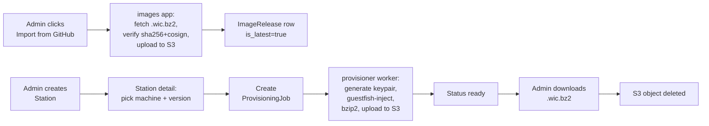

# Server-side Station Provisioning — Design Spec

**Status:** Draft
**Date:** 2026-04-17
**Author:** OE5XRX team

## Problem

We want to onboard new OE5XRX stations — including QEMU test stations
running on a home Proxmox box — from the station-manager web UI with
minimum manual work. Today a new station requires: create the Station
record, generate an Ed25519 device key, download the private key
(copy-paste from a `<pre>`), build a Yocto image, and manually
inject the config + key into its data partition. Too many steps,
easy to mismatch, no provenance trail.

Goal: the admin clicks "Generate provisioning bundle", picks a
machine target + image version, and gets back a single ready-to-boot
`.wic.bz2` with the station's identity already baked in. Everything
else (which release, which key, where to put it) is handled
server-side.

## Non-goals

- **No OTA testing.** Out of scope for this spec.
- **No Proxmox-side automation.** Admins still import the resulting
  `.wic.bz2` into Proxmox / flash to an SD card themselves. That
  matches the real-hardware flow.
- **No automatic GitHub-release watching.** Imports are an explicit
  admin action.

## High-level flow



## New concepts

### App: `images`

Holds the catalog of imported GitHub releases.

**Model `ImageRelease`**

| Field | Type | Notes |
|---|---|---|
| `tag` | CharField | e.g. `v1-alpha`. Unique per machine. |
| `machine` | CharField | `qemux86-64` or `raspberrypi4-64`. |
| `s3_key` | CharField | Object key in the images bucket, e.g. `images/v1-alpha/oe5xrx-qemux86-64.wic.bz2`. |
| `sha256` | CharField(64) | Matches the `.sha256` sidecar at import. |
| `cosign_bundle_s3_key` | CharField(null) | Parallel `.bundle` object; future verification / archival. |
| `size_bytes` | BigIntegerField | For progress bars. |
| `is_latest` | BooleanField | Exactly one True per machine (model-level constraint). |
| `imported_at` | DateTimeField | auto_now_add. |
| `imported_by` | ForeignKey(User, null, SET_NULL) | Audit trail. |

Flipping `is_latest`: whenever a new `ImageRelease` is created with
`is_latest=True`, any previous `is_latest=True` for the same machine
is flipped to `False` in the same transaction.

**View: "Images" admin page** (`/images/`)

- Admin-only.
- Tabular list: tag, machine, size, imported_at, `is_latest` badge,
  download-from-S3 link (for debugging), delete button.
- "Import from GitHub" button opens a form:
  - Tag input (free text; we do not enumerate GitHub tags to keep
    this simple — admin copy-pastes from the releases page).
  - Machine dropdown.
  - Optional: "set as latest" checkbox (default on).
- Submit:
  - Launch background job.
  - Worker downloads `oe5xrx-<machine>-<tag>.wic.bz2` + its `.sha256`
    and `.bundle` from
    `https://github.com/OE5XRX/linux-image/releases/download/<tag>/`.
  - Verify sha256.
  - Verify cosign bundle against the repo's OIDC identity (hardcoded
    expectation: `https://github.com/OE5XRX/linux-image/.github/workflows/release.yml@refs/tags/<tag>`).
  - Upload to S3.
  - Create `ImageRelease` row, flip `is_latest` if requested.

If verification fails: row not created, admin sees error, S3 not
touched. No half-state.

### App: `provisioning`

Co-lives with `apps/stations` or separate. Model-heavy so a separate
app keeps `stations` clean.

**Model `ProvisioningJob`**

| Field | Type | Notes |
|---|---|---|
| `id` | UUIDField(primary_key) | Also used in S3 key for the output file. |
| `station` | ForeignKey(Station) | |
| `image_release` | ForeignKey(ImageRelease) | Picked by admin at submit time. |
| `status` | CharField | `pending`, `running`, `ready`, `downloaded`, `failed`, `expired`. |
| `error_message` | TextField | For `failed`. |
| `output_s3_key` | CharField(null) | Set when `status=ready`. |
| `output_size_bytes` | BigIntegerField(null) | |
| `created_at` | DateTimeField | auto_now_add. |
| `ready_at` | DateTimeField(null) | |
| `downloaded_at` | DateTimeField(null) | |
| `expires_at` | DateTimeField(null) | `ready_at + 1 hour`. |
| `requested_by` | ForeignKey(User, null, SET_NULL) | |

**View: "Provisioning" section on station_detail**

Visible to admins. Layout:

```
┌─ Provisioning ─────────────────────────────────┐
│ Machine:  [ qemux86-64 ▼ ]                      │
│ Version:  [ v1-alpha (latest) ▼ ]               │
│                                                  │
│ [ Generate provisioning bundle ]                │
│                                                  │
│ ─── Install instructions ──────────────────────  │
│ [ CM4 hardware | Proxmox | QEMU direct ]         │
│ <tabbed content>                                 │
└──────────────────────────────────────────────────┘
```

If a job is active for this station:
- `pending` / `running`: replace the form with a spinner + status
  text, HTMX polling `/provisioning/<job-id>/status` every 3 s.
- `ready`: spinner replaced with "Download .wic.bz2 (NN MB)" button.
  Below: "Will be deleted from server once downloaded or after 1h."
- `downloaded` / `expired` / `failed`: small status line, "Generate
  again" button visible.

Generating a bundle while a previous key exists: confirmation dialog,
"this will invalidate the current key".

**Worker: `provisioner` (docker-compose service)**

Same pattern as `alert-monitor`:

```yaml
provisioner:
  image: ghcr.io/oe5xrx/station-manager:latest
  restart: unless-stopped
  command: python manage.py run_provisioner --loop --interval 5
  env_file: [.env]
```

Python management command polls `ProvisioningJob` where
`status='pending'` ordered by `created_at`, processes one at a time.

Per job:
1. Mark `running`.
2. Generate Ed25519 keypair via `DeviceKey.generate_keypair()`.
3. Update the station's `DeviceKey` (replace old, same mechanism as
   the existing regenerate view).
4. Download base image from S3 (`image_release.s3_key`) to
   `/tmp/<job-id>/base.wic.bz2`.
5. `bzip2 -d` to `/tmp/<job-id>/work.wic`.
6. Render `config.yml` from a Jinja2 template with `server_url`,
   `station_id`, `ed25519_key_path=/etc/station-agent/device_key.pem`.
7. Run `guestfish` — see below.
8. `bzip2 -9` the modified `.wic` back to `.wic.bz2`.
9. Upload to S3 under `provisioning/<job-id>/oe5xrx-station-<id>-<machine>-<tag>.wic.bz2`.
10. Set `status='ready'`, `ready_at=now`, `expires_at=now+1h`.
11. Remove `/tmp/<job-id>/`.

Errors at any step → `status='failed'`, `error_message=str(exc)`,
tmpdir cleaned, no S3 output.

Only one job runs at a time; `bzip2 -9` pins a core for a minute.
At our expected rate (a few per month) that's fine.

**guestfish step**

```sh
guestfish --rw -a work.wic <<'EOF'
run
mount /dev/sda4 /
mkdir-p /etc-overlay/station-agent
upload /tmp/config.yml /etc-overlay/station-agent/config.yml
upload /tmp/device_key.pem /etc-overlay/station-agent/device_key.pem
chmod 0600 /etc-overlay/station-agent/device_key.pem
umount /
EOF
```

Partition index (`sda4` for x86-64 wks, **`sda8` for RPi wks** per
`oe5xrx-remotestation-ab.wks.in`) is resolved from the machine field
at job time. `data-init.sh` on first boot sees the files already
present and does not overwrite them — matches what we tested on
real QEMU during earlier debugging.

**Download**

- Endpoint `/provisioning/<job-id>/download/`
- Admin-only, job must be `ready`, must not be expired.
- Streams the S3 object directly (no local re-buffering).
- After the streaming completes successfully: set `status='downloaded'`,
  `downloaded_at=now`, enqueue S3 object deletion (signal → worker
  picks it up on next tick, idempotent delete).
- If the client aborts: status stays `ready`, they can retry.

**Cleanup**

The `provisioner` worker, on each loop iteration, also:
- Deletes S3 objects of `status='downloaded'` jobs.
- Marks jobs with `expires_at<now AND status='ready'` as `expired`
  and deletes their S3 object.

### Install instructions content

Three tabs on the station detail page. Each tab covers the same
underlying operation — write `config.yml` + `device_key.pem` into
`<data-partition>/etc-overlay/station-agent/`.

**Tab 1: Real CM4 hardware**
- `bzcat oe5xrx-station-X.wic.bz2 | sudo dd of=/dev/sdX bs=4M status=progress conv=fsync`
- Insert SD card / boot CM4.

**Tab 2: Proxmox**
- Decompress `bunzip2 oe5xrx-station-X.wic.bz2`.
- `qm importdisk <vmid> oe5xrx-station-X.wic <storage>`
- VM config: BIOS=OVMF, machine=q35, disk=virtio from the imported
  raw disk, serial=socket, net0=virtio/<bridge>.
- Start VM.

**Tab 3: QEMU direct**
- Use the linux-image repo's `scripts/run-qemu.sh` with a manual
  override pointing at this file, or just drop it in the
  `build/qemu-cache/release-<tag>/` dir. (Alternative: extend
  `run-qemu.sh` with a `--bundle <path>` flag later; out of scope
  for this spec.)

## Security

- **Admin-only** for both `images` and `provisioning` pages — same
  gate as the existing `DeviceKey` views.
- **Private key never persisted** — generated inside the worker,
  written straight into the wic, then the `/tmp/<job-id>/` dir is
  removed. DB only stores the public half (same as today).
- **One-time download** — completion deletes the S3 object. Expiry
  1 h covers the case where admin clicks and gets distracted.
- **Audit trail** — both `ImageRelease.imported_by` and
  `ProvisioningJob.requested_by` plus existing `StationAuditLog`
  entries on key rotation.
- **CSRF** — all state-changing operations are POST.
- **S3 objects are private** — download goes through Django
  (streaming), not via public signed URLs, so we can enforce
  admin-only and one-time semantics.

## Testing

- Unit: `ImageRelease` latest-flip transaction, `ProvisioningJob`
  state machine transitions.
- Integration: fake GitHub release + fake S3 → full import path
  via `moto`. Use a tiny 2 MB raw disk image in `tests/fixtures/`
  so the guestfish step runs in CI (CI must have `libguestfs-tools`).
- Golden path E2E: spawn a real QEMU instance from a provisioned
  bundle against a test station-manager, verify heartbeat lands.
  This happens in our actual Proxmox lab once the feature ships,
  not in CI.

## Dependencies

- `libguestfs-tools` (`guestfish` binary) installed in the
  provisioner container image.
- `cosign` binary in the provisioner container for release
  verification. Static binary, ~60 MB.
- `boto3` or `django-storages` configured for Hetzner S3 (the
  project already uses S3 for firmware uploads — reuse that
  bucket or add a sibling).

## Open questions

None at this point — all the decisions from the brainstorming are
captured above.

## Rough effort estimate

- `images` app + import worker: ~1-2 days
- `provisioning` app + worker + guestfish integration: ~2-3 days
- UI (station detail section + images page + install instructions): ~1 day
- Tests + polish: ~1 day

Total: ~1 week of focused work.
