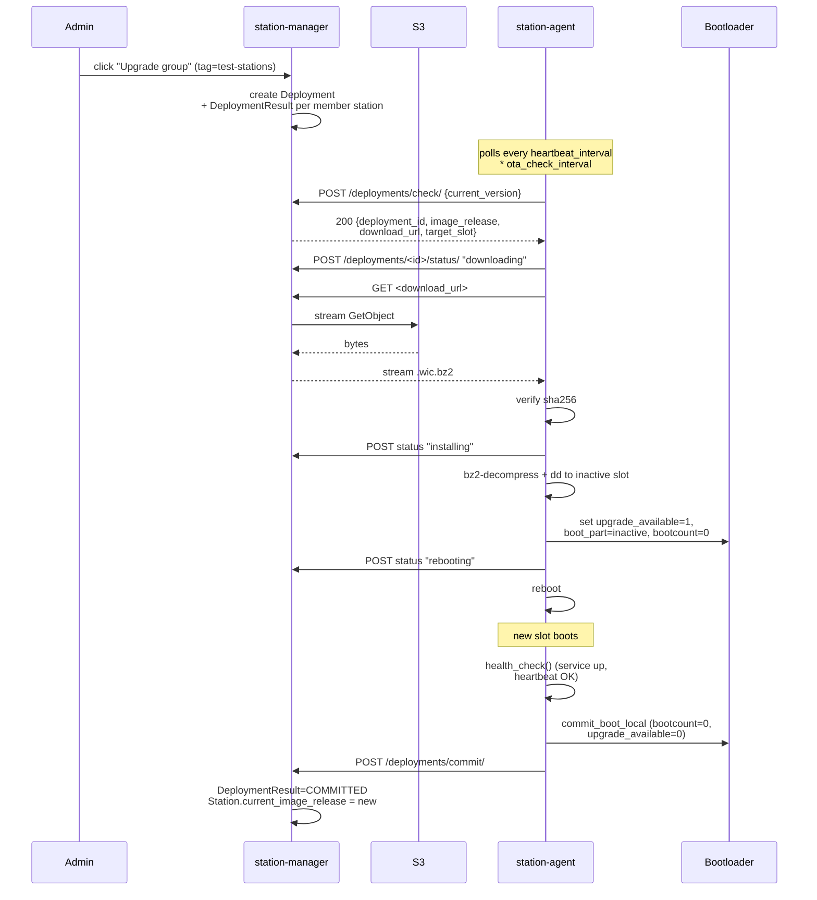

# OS-Image OTA Upgrade Flow — Design Spec

**Status:** Draft
**Date:** 2026-04-19
**Scope:** OE5XRX station-manager + station-agent + (minor) linux-image.
Module firmware (STM32 via dfu-util) is explicitly out of scope; that
will be a separate spec when the module OTA flow is designed.

## Problem

Stations are provisioned today via the Images + Provisioning flow
(imported `ImageRelease` → per-station bundle → flashed to SD card or
imported into Proxmox). After that first flash, there is no way to
move them to a newer release without physical access to each station.

We want the admin to trigger an OS upgrade from the web UI, watch it
roll out, and have the station self-rollback if something goes wrong.

## Non-goals

- **Module firmware OTA.** Separate flow, separate hardware, separate
  spec.
- **Time-based phased rollouts.** We explicitly rejected auto-batching
  with delay windows. Manual control via tag groups is the model.
- **Canary auto-promotion.** The admin decides when to advance to the
  next group by clicking "Upgrade group" on the next tag.
- **Boot-commit watchdog.** Tracked separately in
  [linux-image#14](https://github.com/OE5XRX/linux-image/issues/14).
  MVP relies on the bootloader bootcount mechanism alone.
- **Delta (binary-diff) transfers.** Interface must stay
  forward-compatible (opaque `download_url` returned by the server),
  but MVP ships full-image download only.

## Architecture overview



On any failure during download / install / reboot, the bootloader's
bootcount mechanism reverts to the previous slot after three failed
boot attempts. The agent that comes up on the reverted slot reports
`rolled_back` to the server.

## Data model

### Replace `Deployment.firmware_artifact` with `image_release`

The existing `Deployment` model references `FirmwareArtifact`. That
model stays in the codebase (for future module-firmware OTA), but it
is no longer referenced from `Deployment`. Instead:

```python
class Deployment(models.Model):
    image_release = models.ForeignKey(
        "images.ImageRelease",
        on_delete=models.PROTECT,   # can't delete an image an active
                                     # or historical deployment targets
        related_name="deployments",
    )
    # ... all other existing fields unchanged ...
```

`DeploymentResult` gains a `SUPERSEDED` status:

```python
class Status(models.TextChoices):
    PENDING = "pending"
    DOWNLOADING = "downloading"
    INSTALLING = "installing"
    REBOOTING = "rebooting"
    VERIFYING = "verifying"
    SUCCESS = "success"         # agent committed; this is the committed terminal state
    FAILED = "failed"
    ROLLED_BACK = "rolled_back"
    CANCELLED = "cancelled"
    SUPERSEDED = "superseded"   # NEW — a newer deployment replaced this before agent started
```

### New app `rollouts`

Separate from `deployments` because it's orchestration metadata,
not a per-rollout artifact.

```python
class RolloutSequence(models.Model):
    """Singleton system-wide ordered list of tags for manual phased rollouts."""
    created_at = DateTimeField(auto_now_add=True)
    updated_at = DateTimeField(auto_now=True)
    updated_by = ForeignKey(User, on_delete=SET_NULL, null=True)
    # Ordering lives on RolloutSequenceEntry.position; the singleton exists
    # so future features (multiple named sequences) slot in without a schema
    # migration on existing data.


class RolloutSequenceEntry(models.Model):
    sequence = ForeignKey(RolloutSequence, on_delete=CASCADE, related_name="entries")
    tag = ForeignKey("stations.StationTag", on_delete=CASCADE)
    position = PositiveSmallIntegerField()

    class Meta:
        ordering = ["position"]
        constraints = [
            UniqueConstraint(fields=["sequence", "tag"], name="uniq_tag_per_sequence"),
            UniqueConstraint(fields=["sequence", "position"], name="uniq_position_per_sequence"),
        ]
```

A tag can appear at most once in the sequence. A station with multiple
tags is placed in the **first** matching group in sequence order.
Stations whose tags don't match any sequence entry land in an
"unassigned" bucket at the end of the dashboard.

There is always exactly one `RolloutSequence` row; seed via data
migration. Admin edits its entries.

## Supersession

When the admin triggers a new deployment for a station that already
has a `DeploymentResult` in a non-terminal state (`PENDING`,
`DOWNLOADING`, `INSTALLING`, `REBOOTING`):

- If the existing result is still `PENDING` (agent hasn't picked it up
  yet): mark it `SUPERSEDED`. The new deployment is what the agent
  sees next.
- If the existing result is beyond `PENDING` (agent already started):
  reject the new deployment for that station with a user-visible error
  ("Station X is currently installing v1.2.0; wait for it to finish
  or fail before deploying v1.3.0"). The new deployment continues for
  the other stations in the group.

Supersession is computed inside the `Deployment` creation transaction
so a concurrent poll can't see both results at the same time.

## UI

### Navigation

The existing sidebar has a "Deployments" entry. It becomes a section
with three subpages (admin-only):

1. **Upgrade Dashboard** (default landing page) — `/rollouts/upgrade/`
2. **Rollout Sequence** — `/rollouts/sequence/`
3. **History** — the existing `DeploymentListView` at `/deployments/`

### Upgrade Dashboard

Admin-only. Lists every station grouped by the rollout sequence.

```
┌─ Upgrade Dashboard ────────────────────────────────────────────┐
│ Latest images:  qemux86-64 → v1-Gamma  ·  rpi4 → v1-Gamma      │
│                                                                 │
│ ▾ test-stations (2 pending)              [Upgrade group]        │
│   ○ QEMU-1       qemux86-64   v1-beta → v1-Gamma                │
│   ○ QEMU-2       qemux86-64   v1-beta → v1-Gamma                │
│                                                                 │
│ ▾ easy-access (5 pending)                [Upgrade group]        │
│   ○ OE5XRX-Linz    rpi4       v1-alpha → v1-Gamma               │
│   ● OE5XRX-Wels    rpi4       installing (43%)                  │
│   ○ OE5XRX-Salzburg rpi4      v1-beta → v1-Gamma                │
│   ...                                                           │
│                                                                 │
│ ▾ unassigned (1)                         [Upgrade group]        │
│   ○ OE5XRX-Dev     qemux86-64 v1-beta → v1-Gamma                │
│                                                                 │
│ ▸ up-to-date (12)                                               │
└─────────────────────────────────────────────────────────────────┘
```

**No per-station button on this page.** Single-station upgrades are
triggered from the station detail page.

Row status icons:

- `○` idle (online or offline), upgrade target available
- `●` deployment in progress — live status text (`downloading`,
  `installing (43%)`, `rebooting`, `verifying`)
- `✓` recently committed (30-second fade)
- `✗` recently failed / rolled back
- `⏸` deployment created, agent hasn't polled yet

Live updates: station-detail WebSocket consumer already broadcasts
heartbeat state changes; extend to broadcast `DeploymentResult`
transitions on the same channel so the dashboard can HTMX-swap single
rows without polling.

**"Upgrade group"** button (one per group):

1. Confirm dialog: "Upgrade N stations in `<tag>` to v1-Gamma?"
2. POST to `/rollouts/upgrade/group/<tag_slug>/`
3. Server:
   a. Picks each station that has `<tag>` assigned (and for which
      `<tag>` is the first-matching sequence entry — avoids
      double-deploying a station that also has an earlier tag)
   b. For each machine represented, looks up the latest
      `ImageRelease(machine=..., is_latest=True)`. Every station gets
      the target release for its own machine.
   c. Creates a single `Deployment` per `(target_tag, image_release)`
      tuple. If the group has stations on two machines (rare but
      possible), two Deployments are created atomically.
   d. Creates `DeploymentResult(status=PENDING)` per station, handles
      supersession as described above.
   e. Audit-logs `DEPLOYMENT_TRIGGERED` per station with the target tag
      + release.
4. Redirects back to the dashboard. Live status takes over.

"Upgrade group" on `unassigned` works the same way — every station
without a matching sequence tag is eligible.

### Rollout Sequence

Admin-only. Drag-to-reorder tag list.

```
┌─ Rollout Sequence ────────────────────────────────────────────┐
│ Define the order in which tag groups appear on the Upgrade    │
│ Dashboard. Tags not in this list land in the "unassigned"     │
│ group, shown last.                                             │
│                                                                 │
│  1. ≡ test-stations    [remove]                                │
│  2. ≡ easy-access      [remove]                                │
│  3. ≡ hard-access      [remove]                                │
│                                                                 │
│ Add tag: [ select an unused tag ▼ ]   [Add]                   │
└─────────────────────────────────────────────────────────────────┘
```

Drag-reorder implemented with native HTML5 drag-and-drop (no external
JS dep, keeps CSP `script-src` at SELF+NONCE). A `fetch()` on drag-end
POSTs the new position list to `/rollouts/sequence/reorder/`. Add and
remove go through the adjacent `/rollouts/sequence/add/` and
`/rollouts/sequence/remove/<entry_pk>/` endpoints.

### Station detail

On the existing Station Detail page (admin-only context already
present from the Provisioning card), a new **"Upgrade"** card next to
"Provisioning":

```
┌─ Upgrade ─────────────────────────────────────────────┐
│ Current:   v1-beta                                    │
│ Target:    v1-Gamma (latest for qemux86-64)          │
│                                                        │
│   [Upgrade this station to v1-Gamma]                  │
│                                                        │
│ Recent deployments:                                   │
│   2026-04-17  v1-alpha → v1-beta   committed         │
│   2026-04-15  v0.9.0  → v1-alpha   rolled_back       │
└────────────────────────────────────────────────────────┘
```

If `Station.current_image_release == ImageRelease(is_latest=True,
machine=Station.machine)`: button is disabled, label says "Already on
latest".

If no `ImageRelease(is_latest=True)` exists for the station's machine
(e.g. no import yet): button disabled, label says "No image release
imported yet for this machine".

Click posts to `/rollouts/upgrade/station/<station_pk>/`. Same
backend path as the group upgrade, target_type=STATION.

## API — server ↔ agent

All station-agent endpoints continue to authenticate via
`DeviceKeyAuthentication` (Ed25519 signature on the request body hash).

### `POST /api/v1/deployments/check/`

Agent polls every `heartbeat_interval * ota_check_interval` seconds.

Request body (JSON):
```json
{"current_version": "v1-beta"}
```

`current_version` sourced from the `OE5XRX_RELEASE=` field in
`/etc/os-release` (added by the image recipe's `stamp_release`
postprocess). Forward-looking — MVP uses it only for audit logging;
once deltas ship, the server picks the right delta chain based on
this value.

The server doesn't need `current_machine` in the request: it already
knows each station's machine from `Station.current_image_release.
machine` (set during provisioning). A station that was never
provisioned through our flow has no `current_image_release` and is
ignored by the OTA flow entirely.

Response:

- **200 OK** when a non-terminal `DeploymentResult` exists for this
  station:
  ```json
  {
    "deployment_result_id": 42,
    "deployment_id": 17,
    "target_tag": "v1-Gamma",
    "checksum_sha256": "a1b2c3...",
    "size_bytes": 71234567,
    "download_url": "/api/v1/deployments/17/download/"
  }
  ```

  The agent derives the **inactive slot** to `dd` into locally via
  its existing `bootloader.get_inactive_slot()` helper — no server
  round-trip needed.

  `download_url` is an **opaque path** — the agent must not parse it.
  Today it always points at `DeploymentDownloadView`. A future delta
  rollout could swap it for
  `/api/v1/deployments/17/download-delta/?from=v1-beta`; the agent
  would follow it identically. Auth is carried by the existing
  `DeviceKey` header on every request, so the URL itself stays
  token-free.

- **204 No Content** when there is no pending deployment.

### `GET /api/v1/deployments/<id>/download/`

Stream the deployment's image from S3.

- Authn: `DeviceKeyAuthentication`
- Authz: reject with 403 unless `DeploymentResult.objects.filter(
  deployment_id=id, station=request.auth.station, status__in=[
  PENDING, DOWNLOADING, INSTALLING, REBOOTING])` exists.
- Streams from S3 through the server — **the station never touches
  S3 directly**, never receives S3 credentials, and can only download
  its own active deployments.
- Supports `Range` / `If-Range` for resumable transfers. Slow
  stations on flaky links restart from the last received byte instead
  of from zero. Implementation: translate the incoming `Range` header
  into a `GetObject` range parameter against S3.

`DeploymentDownloadView` already exists but currently serves from
`FirmwareArtifact.file`. Replace the internal source with
`ImageRelease.s3_key` streamed through `default_storage.open(...)`.

### Existing endpoints (unchanged interface)

- `POST /api/v1/deployments/<result_id>/status/` — agent reports
  progress (downloading/installing/rebooting/failed/rolled_back).
- `POST /api/v1/deployments/commit/` — agent reports successful
  commit; server sets `DeploymentResult.status=COMMITTED` **and**
  `Station.current_image_release = Deployment.image_release`. The
  Station write bumps `updated_at` so the dashboard shows the
  freshness.

## Agent-side

### Fill in the `dd → inactive slot` step

`station_agent/ota.py` currently has a placeholder: *"Actual
partition writing is deferred to Yocto integration."* This spec
includes implementing it in Python.

Approach (no external tools required beyond `os.open`):

```python
def install_to_slot(wic_bz2_path: Path, partition_device: str) -> None:
    """Stream-decompress the wic.bz2 into the given block device."""
    decomp = bz2.BZ2Decompressor()
    with open(wic_bz2_path, "rb") as src:
        # os.open returns a raw int fd, not a context manager — close
        # it explicitly in a try/finally so a mid-stream raise doesn't
        # leak it.
        fd = os.open(partition_device, os.O_WRONLY | os.O_SYNC)
        try:
            while chunk := src.read(1 << 20):
                out = decomp.decompress(chunk)
                if out:
                    _write_all(fd, out)
            if not decomp.eof:
                raise ValueError(f"{wic_bz2_path} is a truncated bz2 stream")
            os.fsync(fd)
        finally:
            os.close(fd)
```

Edge cases handled:

- Short `os.write` returns — `_write_all` loops until the buffer is
  drained (block devices usually write in full but safe is safe).
- `fsync` before returning ensures the partition is actually on the
  medium (not just in cache) before we flip the bootloader env.
- `decomp.eof` is the only honest signal that the bz2 stream reached
  its end — SHA-256 over a truncated file that happens to match its
  own expected checksum would not be caught any other way.
  (`BZ2Decompressor` has no `.flush()`; checking `.eof` is the
  idiomatic end-of-stream test.)

### Opaque download URL handling

Change `check_for_update` callers: today they assume the URL is
`/api/v1/deployments/<id>/download/` and build it locally. Agent must
read `download_url` straight out of the check response and use it
verbatim. No hardcoded paths.

### Resume support

When a download is interrupted, the agent retains the partial
`.wic.bz2` and continues on the next OTA tick with `Range:
bytes=N-` where N is the current size. If the server responds `206
Partial Content` the agent appends to the partial file; if it
responds `200 OK` (e.g. the underlying object changed checksum) the
agent discards the partial and restarts. The sha256 check at the end
still gates whether the download is trusted.

### Version tracking

The agent must report `current_version` in
`/deployments/check/`. Value sourced from `PRETTY_NAME` in
`/etc/os-release`, stripped of the `"OE5XRX Remote Station "` prefix
— there's already an `OE5XRX_RELEASE=` field in os-release (added by
the image recipe's `stamp_release`) that's cleaner to parse.

## Image recipe changes

`IMAGE_INSTALL` gains `bzip2` in
`meta-oe5xrx-remotestation/recipes-core/images/oe5xrx-remotestation-image.bb`.

Python `bz2` stdlib is what the agent uses at runtime; the CLI is
there purely for debugging convenience (ssh in, `bzcat some.wic.bz2
| less -R`, etc.).

No other image changes in this spec. The boot-watchdog work from
[linux-image#14](https://github.com/OE5XRX/linux-image/issues/14)
lands separately.

## Error handling

Deterministic mapping of failure modes to user-visible state:

| Failure | Detected by | Result status | Next action |
|---|---|---|---|
| Download times out | agent HTTP timeout | `FAILED` | retry via next OTA tick (no state change, stays `DOWNLOADING` on server until explicit failure reported) |
| sha256 mismatch | agent | `FAILED` | partial file deleted, retry |
| `dd`-to-slot I/O error | agent | `FAILED` | bootloader env untouched, station keeps running old slot |
| Agent calls reboot, new slot won't boot at all | bootloader bootcount | eventually `ROLLED_BACK` after agent on the reverted slot reports in | — |
| New slot boots, health check fails | agent on new slot | stays un-committed; after 3 boots bootloader reverts | `ROLLED_BACK` |
| Admin cancels while `PENDING` | server | `CANCELLED` | — |
| Admin cancels while `INSTALLING` | server | `CANCELLED` (best-effort; agent keeps running its current step — cancels take effect at the **next** `/deployments/check/`, and a cancelled deployment currently installing will still commit if it succeeds) | — |
| `ImageRelease` row removed | prevented by `on_delete=PROTECT` | — | admin sees a UI error |

## Testing

### Unit

- `RolloutSequence.entries.order_by("position")` is the single source of
  ordering; adding / removing / reordering entries preserves uniqueness.
- Station-to-group mapping: a station with tags
  `[test-stations, easy-access]` and sequence
  `[test-stations, easy-access, ...]` is assigned to `test-stations`
  (first match wins).
- Supersession: creating a second Deployment for a station whose
  previous `DeploymentResult` is `PENDING` flips the previous to
  `SUPERSEDED` in the same DB transaction. A result past `PENDING`
  blocks the new creation instead.
- `Deployment.image_release.on_delete=PROTECT` — `ImageRelease.delete()`
  raises `ProtectedError` when any deployment references it.

### Integration

- Pipeline: create deployment → check endpoint returns expected JSON →
  download endpoint streams the correct S3 object → status updates
  flow → commit sets `Station.current_image_release`.
- Range request on the download endpoint returns 206 with correct
  byte range.
- Download-authorisation: another station's Ed25519 key can't pull
  deployment artifacts.

### End-to-end (manual, after deploy)

1. Tag a new `linux-image` release (e.g. `v2-alpha`), import via
   Images page.
2. From Upgrade Dashboard: "Upgrade group" on `test-stations`.
3. Watch live progress on dashboard — expect the QEMU station to go
   `downloading → installing → rebooting → committed` and the badge
   to flip to v2-alpha.
4. Verify in-VM: `cat /etc/os-release` shows new `OE5XRX_RELEASE`;
   `grub-editenv list` shows `bootcount=0` and `upgrade_available=0`.
5. Simulate failure: provision a purposely-broken image, trigger
   upgrade, watch the station cycle through 3 failed boots, confirm
   auto-rollback to the old slot and the server seeing
   `ROLLED_BACK`.

## Effort estimate

Rough breakdown (for the follow-up writing-plans pass):

- Data-model changes + migration (`Deployment.image_release`,
  `DeploymentResult.SUPERSEDED`, `RolloutSequence` + entry): 0.5 day
- Upgrade-Dashboard view + template + WebSocket-driven row updates:
  1.5 days
- Rollout-Sequence page (drag-reorder + add/remove): 0.5 day
- Server-side "upgrade group" + "upgrade station" endpoints + audit
  logging + supersession transaction: 1 day
- Download proxy refactor (FirmwareArtifact → ImageRelease, Range
  support): 0.5 day
- Agent `install_to_slot` implementation + resume-download + opaque
  URL handling + `current_version` reporting: 1 day
- Image recipe `bzip2` addition: 15 minutes (trivial)
- Integration + unit tests: 1 day
- Manual E2E + docs: 0.5 day

Total: ~6-7 focused days.

## Open questions

None. All decisions were made during the brainstorming session.

## References

- Provisioning spec (the "install" side this upgrade flow replaces
  for running stations):
  `docs/superpowers/specs/2026-04-17-server-side-provisioning-design.md`
- Boot-commit watchdog (defense-in-depth companion, separate delivery):
  [linux-image#14](https://github.com/OE5XRX/linux-image/issues/14)
